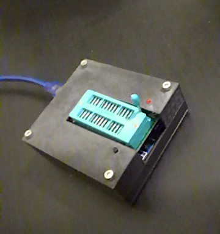
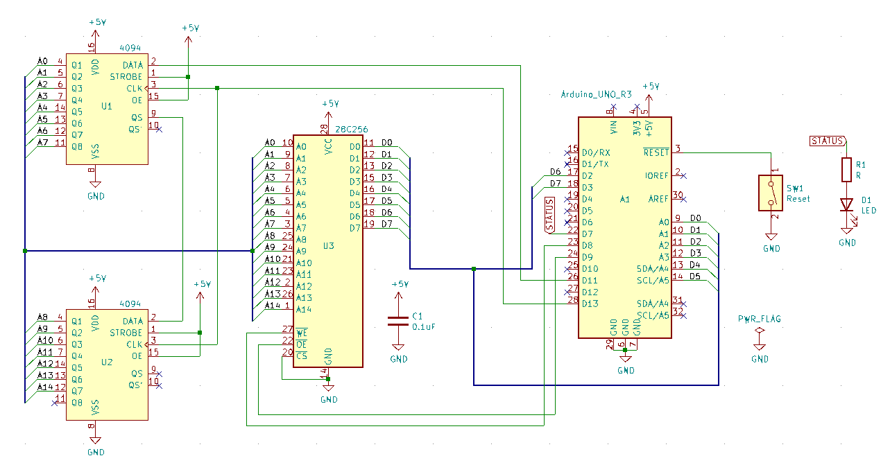

# 28256_eeprom_flasher
Hardware and software for an EEPROM flasher for 28256 EEPROMs.

## How does it work?
- The electronics CAD files are in the `electronics`. You will need Kicad to open them.
- The 3d printed plastic enclosure CAD files are in the `mechanical` folder. You will need FreeCAD.
- The Arduino sketch is in the `firmware` folder.
- The Python script (to communicate with the flasher) is in the `software` folder.

## I just want it
Then you can simply download [the production files](production-files.zip):
- Send the `gerber.zip` file to a PCB manufacturer
- Use a 3d printer to print the two `.obj` files
- Checkout the Git repository to download the software

